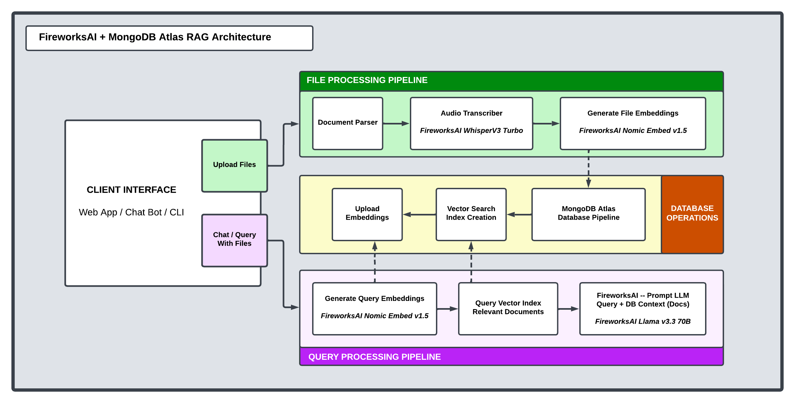

# EarningsAI Demo

Transform earnings calls and financial documents into actionable insights using AI-powered analysis.

## Table of Contents
- [Overview](#overview)
- [Architecture](#architecture)
- [Features](#features)
- [Installation](#installation)
- [Configuration](#configuration)
- [Usage](#usage)
- [Project Structure](#project-structure)
- [Implementation Details](#implementation-details)
- [Examples](#examples)
- [Components](#components)
- [Testing](#testing)
- [Contributing](#contributing)
- [Troubleshooting](#troubleshooting)
- [License](#license)
- [Acknowledgments](#acknowledgments)

## Overview

EarningsAI Demo is a powerful tool that combines audio transcription, document processing, and AI-powered analysis to help users extract insights from earnings calls and financial documents. Built with Fireworks AI and MongoDB, it provides both a command-line interface and a web application for processing and querying financial data.

### Architecture


### Features

- **Audio Transcription**: Automatically transcribe earnings calls using Fireworks AI's Whisper v3
- **Document Processing**: Extract text from PDF, DOCX, and TXT files
- **Vector Search**: Store and retrieve documents using MongoDB's vector search capabilities
- **Natural Language Querying**: Ask questions about your documents in plain English
- **Web Interface**: User-friendly UI for uploading documents and querying insights
- **Batch Processing**: Handle multiple files and documents efficiently

## Installation

### Prerequisites

- Python 3.8+
- MongoDB Atlas account
- Fireworks AI API key

### Setup

1. Clone the repository:
```bash
git clone https://github.com/yourusername/earnings-ai-demo.git
cd earnings-ai-demo
```

2. Create and activate a virtual environment:
```bash
python -m venv .venv
source .venv/bin/activate  # On Windows: .venv\Scripts\activate
```

3. Install dependencies:
```bash
pip install -r requirements.txt
```

## Configuration

1. Update `config/config-example.yaml` file with your credentials and rename to `config/config.yaml`:
```yaml
fireworks:
  api_key: "your_fireworks_api_key"

mongodb:
  uri: "your_mongodb_uri"
```

⚠️ **Security Note**: Never commit credentials to version control. Use environment variables in production.

### Environment Variables (Alternative)
You can also set credentials using environment variables:
```bash
export FIREWORKS_API_KEY="your_fireworks_api_key"
export MONGODB_URI="your_mongodb_uri"
```

## Usage

### Web Interface

1. Start the Streamlit app:
```bash
streamlit run earnings_ai_demo/earnings_ai_demo/app.py
```

2. Open your browser at `http://localhost:8501`
3. Upload documents or audio files
4. Ask questions about your uploaded content

### Command Line Interface

Process a directory of files:
```bash
python earnings_ai_demo/earnings_ai_demo/main.py
```

The script will:
1. Process all audio files in `data/audio/`
2. Process all documents in `data/documents/`
3. Store processed data in MongoDB
4. Run sample queries

## Project Structure

```
earnings-ai-demo/
├── config/
│   └── config.yaml         # Configuration file
├── data/
│   ├── audio/             # Audio files for processing
│   └── documents/         # Documents for processing
├── earnings_ai_demo/
│   ├── __init__.py
│   ├── app.py            # Streamlit web interface
│   ├── database.py       # MongoDB operations
│   ├── embedding.py      # Vector embedding generation
│   ├── extraction.py     # Document text extraction
│   ├── main.py          # CLI entry point
│   ├── query.py         # Query processing
│   └── transcription.py  # Audio transcription
├── tests/
│   ├── conftest.py
│   ├── test_database.py
│   ├── test_embeddings.py
│   ├── test_extraction.py
│   ├── test_query.py
│   └── test_transcription.py
├── requirements.txt
├── setup.py
└── README.md
```

## Implementation Details

### Query Processing

The system uses Fireworks AI's LLM for processing queries about MongoDB earnings data. Here's how it works:

```python
# From query.py
def query(self, query: str, company_ticker: Optional[str] = None, 
          doc_type: Optional[str] = None, num_results: int = 5) -> Dict:
    # Generate embedding for the query
    query_embedding = self.client.embeddings.create(
        input=[query],
        model=self.embedding_model
    ).data[0].embedding

    # Apply filters if specified
    filters = {}
    if company_ticker:
        filters["metadata.company_ticker"] = company_ticker
    if doc_type:
        filters["metadata.document_type"] = doc_type

    # Retrieve relevant documents
    relevant_docs = self.db.query_similar(query_embedding, limit=num_results, filters=filters)

    # Build context from retrieved documents
    context = self._build_context(relevant_docs)
    
    # System prompt for MongoDB earnings analysis
    system_prompt = "You are analyzing MongoDB earnings data. Use only information from the provided context. Include specific numbers and details when available."
    
    # Generate response using Fireworks AI
    response = self.client.chat.completions.create(
        model=self.model,
        messages=[
            {"role": "system", "content": system_prompt},
            {"role": "user", "content": f"Context:\n{context}\n\nQuestion: {query}\n\nProvide an answer using only the context."}
        ]
    )

    return {
        "response": response.choices[0].message.content,
        "sources": relevant_docs
    }
```

### Vector Search Implementation

MongoDB vector search is implemented in the DatabaseOperations class:

```python
# From database.py
def query_similar(self, query_embedding: List[float], limit: int = 5, filters: Dict = None) -> List[Dict]:
    pipeline = [
        {
            "$vectorSearch": {
                "index": "vector_index",
                "queryVector": query_embedding,
                "path": "embeddings",
                "numCandidates": limit * 10,
                "limit": limit
            }
        }
    ]
    
    if filters:
        pipeline.append({"$match": filters})
        
    pipeline.append({
        "$project": {
            "text": 1,
            "metadata": 1,
            "score": {"$meta": "vectorSearchScore"}
        }
    })
    
    return list(self.documents.aggregate(pipeline))
```

## Examples

### 1. Processing Audio Files

```python
# Initialize transcriber
transcriber = AudioTranscriber(api_key="your_api_key")

# Process single file
result = await transcriber.transcribe_file(
    "earnings_call.mp3",
    metadata={"company": "MDB", "quarter": "Q3"}
)

# Process directory
results = await transcriber.transcribe_directory(
    "data/audio",
    metadata={"year": "2024"}
)
```

### 2. Document Processing

```python
# Initialize extractor
extractor = DocumentExtractor()

# Process PDF
pdf_result = extractor.extract_text("quarterly_report.pdf")

# Process DOCX
docx_result = extractor.extract_text("presentation.docx")

# Process directory
all_docs = extractor.process_directory("data/documents")
```

### 3. Generating Embeddings

```python
# Initialize embedding generator
embedding_gen = EmbeddingGenerator(api_key="your_api_key")

# Single text embedding
embedding = embedding_gen.generate_embedding(
    "MongoDB reported strong Q3 results",
    prefix="earnings: "
)

# Batch processing
texts = ["First document", "Second document"]
embeddings = embedding_gen.generate_embeddings_batch(texts)

# Document embedding with chunking
long_text = "... very long document ..."
doc_embedding = embedding_gen.generate_document_embedding(
    long_text,
    method="mean"  # or "max"
)
```

### 4. Database Operations

```python
# Initialize database
db_ops = DatabaseOperations("mongodb_uri")

# Store document
doc_id = db_ops.store_document(
    text="Quarterly earnings report content...",
    embeddings=[0.1, 0.2, ...],  # 768-dimensional vector
    metadata={
        "company": "MDB",
        "document_type": "earnings_call",
        "date": "2024-03-21"
    }
)

# Query similar documents
similar_docs = db_ops.query_similar(
    query_embedding=[0.1, 0.2, ...],
    limit=5,
    filters={"metadata.company": "MDB"}
)
```

### 5. Example Queries

```python
# Initialize query interface
query_interface = QueryInterface(api_key="your_api_key", database_ops=db_ops)

# Basic query
result = query_interface.query(
    "What was MongoDB's revenue growth in Q3?"
)

# Filtered query
result = query_interface.query(
    "What are the key AI initiatives?",
    company_ticker="MDB",
    doc_type="earnings_call"
)

# Streaming query
async def handle_chunk(chunk):
    print(chunk)

await query_interface.process_streaming_query(
    "Summarize the earnings highlights",
    handle_chunk
)
```

### 6. Web Interface Usage

```python
# Initialize app
app = EarningsAIApp()

# Process uploaded files
results = await app.process_files([
    uploaded_file1,
    uploaded_file2
])

# Query documents
response, sources = await app.query_documents(
    "What is MongoDB's cloud strategy?"
)
```

## Components

### Core Modules

- **DatabaseOperations**: Manages MongoDB interactions and vector search
- **AudioTranscriber**: Handles audio file transcription using Fireworks AI
- **EmbeddingGenerator**: Creates vector embeddings for text and documents
- **DocumentExtractor**: Extracts text from various document formats
- **QueryInterface**: Processes natural language queries and retrieves relevant information

### Key Features

#### Vector Search
- Uses MongoDB Atlas Vector Search
- 768-dimensional embeddings from Nomic AI
- Supports filtered queries by company and document type

#### Audio Transcription
- Supports MP3, WAV, FLAC, M4A formats
- Automatic language detection
- Metadata extraction and storage

#### Document Processing
- Supports PDF, DOCX, TXT formats
- Automatic text extraction
- Metadata preservation


## Testing

### Prerequisites
```bash
pip install pytest pytest-asyncio
```

### Test Data Setup

1. Create test data directories:
```bash
mkdir -p data/audio data/documents
```

2. Add sample files:
   - Audio: Place sample MP3 files in `data/audio/`
   - Documents: Place sample PDF, DOCX, and TXT files in `data/documents/`

### Running Tests

#### 1. Complete Test Suite
Run all tests:
```bash
pytest -v
```

#### 2. Component-Specific Tests

##### Audio Transcription Tests
```bash
# Test transcription functionality
pytest tests/test_transcription.py -v

# Key tests:
pytest tests/test_transcription.py::test_single_file_transcription
pytest tests/test_transcription.py::test_metadata_handling
pytest tests/test_transcription.py::test_file_not_found
```

##### Document Extraction Tests
```bash
# Test document processing
pytest tests/test_extraction.py -v

# Key tests:
pytest tests/test_extraction.py::test_txt_extraction
pytest tests/test_extraction.py::test_pdf_extraction
pytest tests/test_extraction.py::test_process_directory
```

##### Embedding Tests
```bash
# Test embedding generation
pytest tests/test_embeddings.py -v

# Key tests:
pytest tests/test_embeddings.py::test_single_embedding
pytest tests/test_embeddings.py::test_batch_embeddings
pytest tests/test_embeddings.py::test_document_chunking
pytest tests/test_embeddings.py::test_prefix_handling
```

##### Database Tests
```bash
# Test MongoDB operations
pytest tests/test_database.py -v

# Key tests:
pytest tests/test_database.py::test_store_document
pytest tests/test_database.py::test_query_similar
pytest tests/test_database.py::test_update_document
```

##### Query Interface Tests
```bash
# Test query processing
pytest tests/test_query.py -v

# Key tests:
pytest tests/test_query.py::test_basic_query
pytest tests/test_query.py::test_filtered_query
pytest tests/test_query.py::test_streaming_query
```

### Test Configuration

1. Create a test configuration file `tests/test_config.yaml`:
```yaml
fireworks:
  api_key: "your_test_api_key"

mongodb:
  uri: "your_test_mongodb_uri"
```

2. Set up test environment variables:
```bash
export FIREWORKS_TEST_API_KEY="your_test_api_key"
export MONGODB_TEST_URI="your_test_mongodb_uri"
```

### Test Coverage

Generate test coverage report:
```bash
pytest --cov=earnings_ai_demo tests/
```

### Integration Testing

Test the complete pipeline:
```python
# tests/test_integration.py
import pytest
from earnings_ai_demo.main import main

@pytest.mark.asyncio
async def test_full_pipeline():
    await main()
```

Run integration tests:
```bash
pytest tests/test_integration.py -v
```

### Expected Test Results

```plaintext
tests/test_transcription.py::test_single_file_transcription PASSED
tests/test_transcription.py::test_metadata_handling PASSED
tests/test_transcription.py::test_file_not_found PASSED

tests/test_extraction.py::test_txt_extraction PASSED
tests/test_extraction.py::test_pdf_extraction PASSED
tests/test_extraction.py::test_process_directory PASSED

tests/test_embeddings.py::test_single_embedding PASSED
tests/test_embeddings.py::test_batch_embeddings PASSED
tests/test_embeddings.py::test_document_chunking PASSED
tests/test_embeddings.py::test_prefix_handling PASSED

tests/test_database.py::test_store_document PASSED
tests/test_database.py::test_query_similar PASSED
tests/test_database.py::test_update_document PASSED

tests/test_query.py::test_basic_query PASSED
tests/test_query.py::test_filtered_query PASSED
tests/test_query.py::test_streaming_query PASSED
```

### Common Test Issues

1. **MongoDB Connection Failures**
   - Solution: Ensure MongoDB is running and test URI is correct
   ```bash
   pytest tests/mongo_test.py
   ```

2. **Missing Test Files**
   - Solution: Verify test data exists
   ```bash
   ls data/audio/
   ls data/documents/
   ```

3. **API Rate Limits**
   - Solution: Use test API key with sufficient quota
   ```python
   # tests/conftest.py
   @pytest.fixture(autouse=True)
   def rate_limit_delay():
       yield
       time.sleep(1)  # Add delay between API calls
   ```

4. **Async Test Failures**
   - Solution: Ensure pytest-asyncio is installed and imported
   ```python
   import pytest
   pytestmark = pytest.mark.asyncio
   ```

### Test Environment Cleanup

After running tests:
```bash
# Clean up test files
rm -rf data/audio/*_transcription.json
rm -rf data/documents/*.json

# Reset test database
python -c "from earnings_ai_demo.database import DatabaseOperations; DatabaseOperations('test_uri').documents.delete_many({})"
```

## Contributing

1. Fork the repository
2. Create a feature branch
3. Commit changes
4. Push to the branch
5. Open a Pull Request

### Code Style
- Follow PEP 8
- Add docstrings to functions and classes
- Write unit tests for new features

## Troubleshooting

### Common Issues

1. **MongoDB Connection Issues**
   - Ensure your IP is whitelisted in MongoDB Atlas
   - Check network connectivity
   - Verify credentials in config.yaml

2. **API Rate Limits**
   - Implement exponential backoff (built into the embedding generator)
   - Monitor Fireworks AI usage limits

3. **File Processing Errors**
   - Check file permissions
   - Verify file formats are supported
   - Ensure files aren't corrupted

4. **Vector Search Issues**
   - Wait for index build completion
   - Check index definition matches embedding dimensions
   - Verify documents are properly embedded

5. **Memory Issues with Large Files**
   - Use streaming for large audio files
   - Implement chunking for large documents
   - Monitor RAM usage during batch processing

## License

This project is licensed under the MIT License. See the LICENSE file for details.

## Acknowledgments

- Fireworks AI for their powerful ML models
- MongoDB for vector search capabilities
- The open-source community for various Python libraries

---

**Note**: For production deployments, ensure proper security measures are in place and never expose sensitive credentials in configuration files or version control.